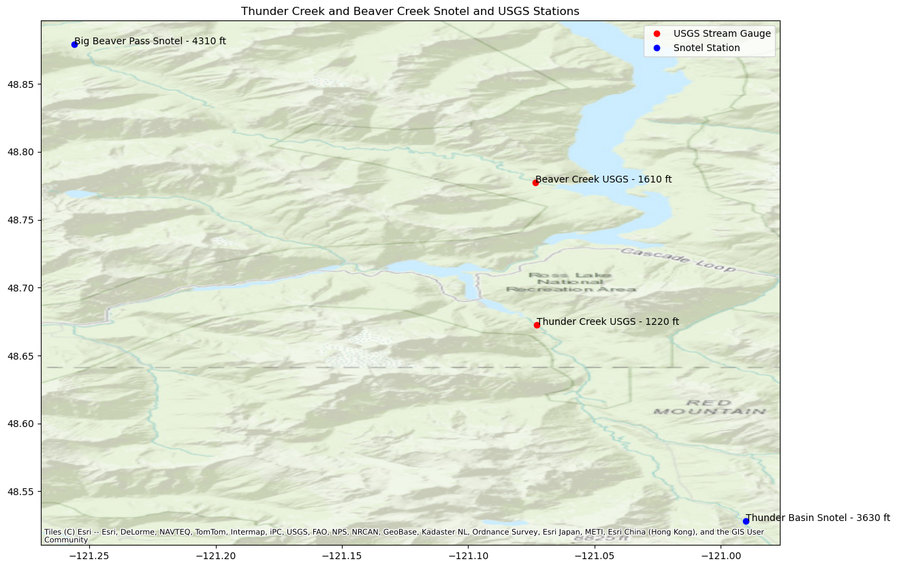
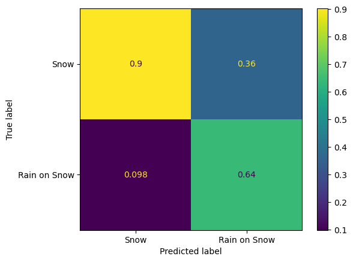
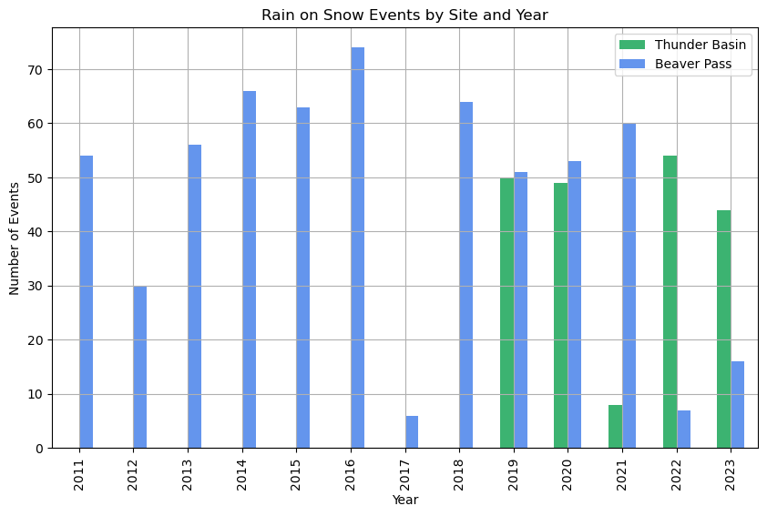
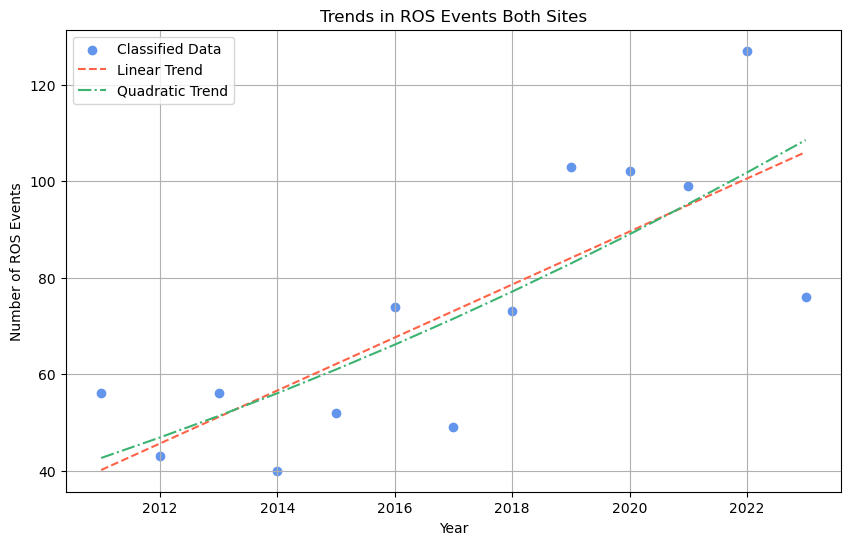
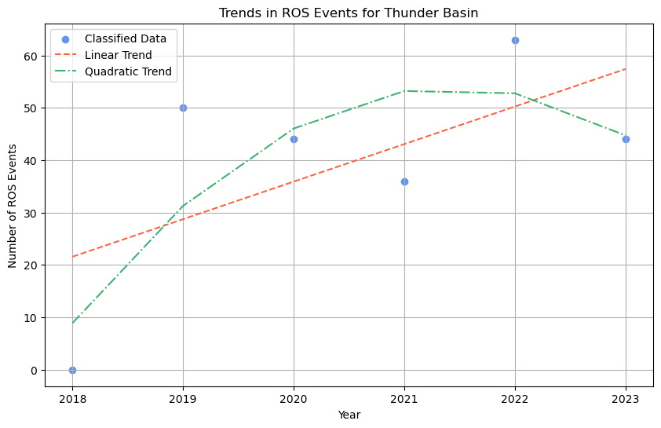
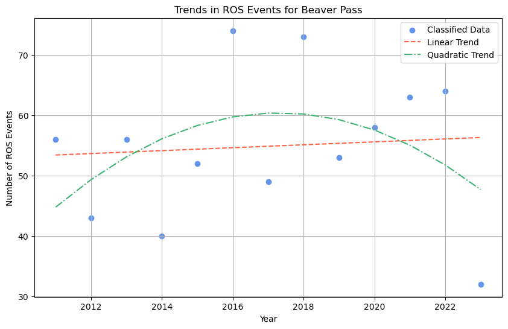

# Flakes & Flows: Classifying High Flow Events in Snowpack Driven Watersheds

### Members: Max Stecher, Hailey Sparks, Jesse Akes

### Summary
The goal of this project is to model and classify high flow events in Thunder Creek in Washington state. Using streamflow gauge data and nearby SNOTEL sites, we aim to determine peak over threshold flow events and what meterological conditions led to them. Were they rain or snow? The frequency of these events is important to understand as climate change impacts the western united states threatening atypical flooding during winter seasons and diminishing water sotrage (as snow) for later parts of the water year. 

### Background

### Problem Statement/Questions/Objectives
* Are we able to model and classify events (snow, rain, or rain on snow) that cause high flows/pulses (peak over threshold events) in snowpack driven watersheds?
* What meterological conditions are required to cause these events?
* Are we able to predict peak over thresholds given these events and conditions? 

### Datasets
* [USGS Stream Gauge Data (Thunder Creek)](https://waterdata.usgs.gov/monitoring-location/12175500/#dataTypeId=continuous-00060-0&period=P7D&showMedian=false)
* [Snotel Sites](https://www.arcgis.com/apps/mapviewer/index.html?layers=719ef67bd41047bd952e497cbe6961d0)
* [Thunder Basin SNOTEL](https://wcc.sc.egov.usda.gov/nwcc/site?sitenum=817)
* [Beaver Pass SNOTEL](https://wcc.sc.egov.usda.gov/nwcc/site?sitenum=990)
* [USGS Stream Gauge Data (Big beaver Creek)](https://waterdata.usgs.gov/monitoring-location/12172000/#dataTypeId=continuous-00065-0&period=P7D&showMedian=false)

### Tools/Packages
* [Metloom](https://github.com/M3Works/metloom) - Used to retrieve snotel and USGS data
* [Seaborn](https://seaborn.pydata.org/) - Used for plotting confusion matrices
* [Scikit-Learn](https://scikit-learn.org/stable/) - Used for a variety of analyses, including Decision Tree regression and classification 
* [hvplot](https://github.com/holoviz/hvplot) - Used to generate pretty plots
* [matplotlib](https://matplotlib.org/)  - Used to generate pretty plots
* [xarray](https://docs.xarray.dev/en/stable/) - Used to handle time series data for snotel sites and Streamguages
* [pint-xarray](https://pint-xarray.readthedocs.io/en/stable/) - Used as a convenience wrapper for using pint in xarray objects
* [Numpy](https://numpy.org/) - Used to store data in matrix form for quantitative analysis and regression/classification

### Methodology
1. **Data Processing**: Identify unobstructed waterways that have a [SNOTEL site](https://www.nrcs.usda.gov/wps/portal/wcc/home/aboutUs/monitoringPrograms/automatedSnowMonitoring/) above a USGS Streamgauge - we used Beaver Pass SNOTEL paired with Beaver Creek Streamgauge and the neighboring Thunder Basin SNOTEL paired with the Thunder Creek steamgage. Once identified, we downloaded hourly SNOTEL SWE, AIR TEMP, ACCUMULATED PRECIPITATION, and SNOWDEPTH and 15-minute USGS discharge data from 1980-2024.
2. Once downloaded, we realized that data was missing for several large chunks - and including pre-2019 for Thunder Basin. So, we excluded any missing data and algined/resampled the hourly snotel data down to a 15-minute frequency to feed to a decision tree classifier.
4. The decision tree was built using sci-kit learn, and relied on SWE, Accumulated Precip, Discharge and Air Temp as inputs, and output the predicted dsicharge at a given time. We then compared against out input discharge to determine our accuracy. 
5. After running the classifier, we predicted discharge and classified events, outputting a correlation matrix and a confusion matrix to validate/confirm the accuracy of our results.
6. With our classified events we analyzed the entire time span 2011-2024, and looked at the frequency of these rain on snow events per year, and tried to understand any trends that surfaced. 

### Expected Outcome
A way to a metrologically classify high flow events in snowpack driven water sheds

### Results
#### Area of Study
As noted above, we looked at Thunder Creek and Big Beaver Creek in the North Cascades of Washington

#### Building the Decision Tree and Classifier

After building the decision tree, we compared it against 'ground truth' events that were maunally identified and got the resulting confusion matrix:

It indicates that our classifier is good at positively identifiying snow only events, but often (36% of the time) miscatagorized purely snow events as rain on snow events. 

#### Frequency of Events Analysis
With our data classified, we tried to analyze trends in these events: were they happening more frequently? How were they distributed across nearby sites? 

With so little data, especially for Thunder Basin, it was hard to draw any conclusions. We see varied trends by year, but nothing worth noting. We applied a linear and quadratic regression across sites and actually saw an increase, which may indicatuve of longer term weather patterns of more precipitation in general and less of it following as snow, but it's hard to be conclusive. 

#### Future Work
As noted above, our ground truth classification was quite naive. We only considered events based on discharge in the winter, assuming that a spike was a rain on snow event. However, the spatial and elevation variation between our SNOTEL Site and Streamguage likely caused a lot of issues. Without even attempting to find the rain/snow partition (we assumed that rain or snow was happening at all points regardless of variation), we are likely being influenced by runoff/rain from lower elevations, but snow at higher elevations. It's important to understand that these patterns exist in a  gradient and are non-binary as we've defined. 

We'd also want to find a better data source - the snotel sites in this region have limited data to run an analysis on (typicl climatalogical anlysis requires a minimum of a 30 year span) both in availability and in variety of parameters. 

On the classifier side: There are many updates that can be made to the classification algorithm. Firstly, we could consider a different baseline value that is used to distinguish betweem snow and rain on snow events. But more significantly, it would be better to explore multi-classification. In this work, we only explored binary classification (snow or rain on snow). But realistically, these events cannot be sorted into these black and white events. However, a final goal would to develop a more robust mathematical model to analyze rain and snow dynamics. 

### References
*Brown, D. M., et al. "Max Temps at which Snow Forms by Region." Journal of Geophysical Research: Atmospheres, vol. 124, no. 17, 2019, pp. 9516-9533, https://doi.org/10.1029/2018JD030140.

*Bormann, K. J., et al. "Snowpack Runoff." iScience, vol. 25, no. 8, 2022, Article 104821, https://doi.org/10.1016/j.isci.2022.104821.

*Lute, M. T., and D. G. Tarboton. "Mountain Rain vs. Snow." Proceedings of the International Snow Science Workshop (ISSW 2024), Montana State University, 2024, https://arc.lib.montana.edu/snow-science/objects/ISSW2024_P1.13.pdf.

*Rupp, T. S., et al. "Rain on Snow Changes in the 21st Century." Climatic Change, vol. 179, no. 1, 2024, pp. 1-15, https://doi.org/10.1007/s00382-024-07351-7.

